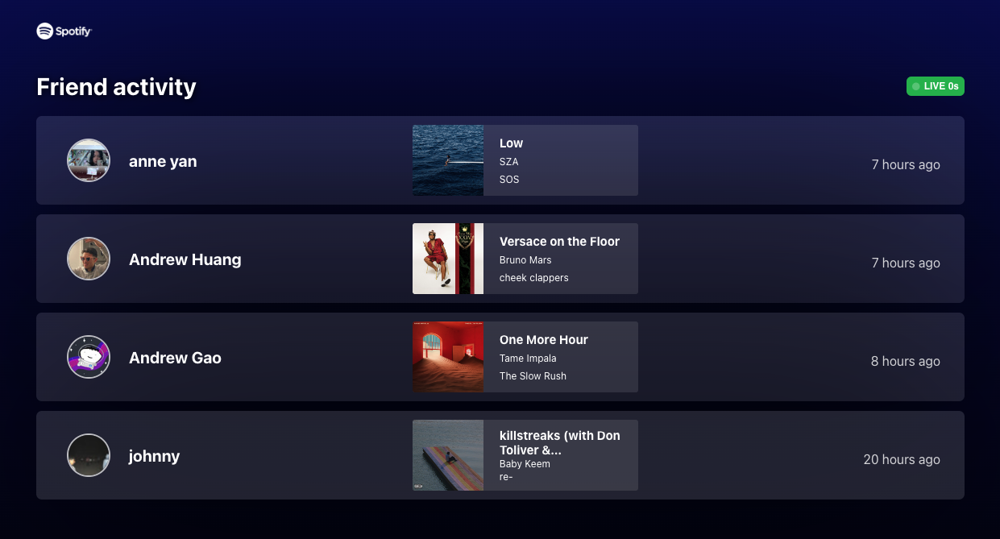

# About Me

!!! Currently looking for new opportunities (full stack, backend, frontend), in that order. 
I was recently laid off at Apollo GraphQL and have prior experience fullstack at Apollo GraphQL, ServiceNow, IoTeX, and NASA.
!!!

Hi! I'm Jeffrey :wave:. I'm a Taiwanese American :flag-tw: :flag-us: software engineer born and raised in the Bay Area, CA. 
I graduated from Cornell University in 2022, with a bachelors degree in Computer Science. As a developer, I'm constantly in the pursuit of learning and seek to better myself everyday. 

Outside of work, some of my passions include number one, weightlifting :weight_lifter:. I love going to the gym and lifting heavy weight. Number two, surfing :man-surfing:. It's a new hobby I picked up during quarantine but it's super fun and I suggest you try it too. I often drive down to Santa Cruz where the conditions are best. No. 3, fashion :kimono:. I love keeping up with the latest fashion trends!

## Work Experience
- **Software Engineer**, Apollo GraphQL (backend/infra) Aug-Dec 2022
- **Software Engineer Intern**, Apollo GraphQL (fullstack) May-Sept 2021
- **Software Engineer Intern**, ServiceNow (fullstack) May-Aug 2020
- **Software Engineer Intern**, IoTeX (fullstack) Jun-Aug 2019
- **Planteray Sciences Intern**, NASA (habitable planet research) Jul 2016-Aug 2018

## Education
- **B.A.**, Computer Science, 2018-2022 **Cornell University**

## Projects

### Mario 3 in Typescript
Recreation of a stage of Mario 3 in Typescript with Phaser3, Webpack, NodeJS, Tiled.

--

[!button variant="info" icon=":video_game:" iconAlign="right" text="Click here to play!"](https://jchoucode.github.io/mario3-ts/)    [!button variant="info" icon="mark-github" iconAlign="right" text="View source on Github"](https://github.com/JChouCode/mario3-ts)

A little background on why I made this game, I was interning at IoTeX (my first official internship) and a decent amount of their codebase was written in Typescript and Golang. I wanted to be able to learn both languages so what better way to learn a programming language than by coding out a game! 

Coded from scratch with :blue_heart:. You may experience a few strange bugs (easter eggs) LOL.

### Spotify Friend Activity

Have you ever noticed that in spotify mobile, you can't see what music your friends are listening to while you can on the desktop app? This frustrated me so I decided to create a solution of my own. 

--

[!button variant="info" icon="rocket" iconAlign="right" text="See the app live"](https://spotify-friend-activity.onrender.com/)   or  [!button variant="info" icon="mark-github" iconAlign="right" text="View on Github"](https://github.com/JChouCode/spotify-friend-activity)

Spotify Friend Activity was built with React, React Static, Node, and Express. Hosted on Render! The idea was to be able to see my friend's spotify activity easily via a web app. 

#### How I made it

**TLDR:** By intercepting Spotify Desktop's web requests, I was able to locate the endpoint Spotify used to get friend data. I then found the token they used to authenticate and hit it via a CORs proxy.

To start, I needed a way of getting that friend data which wasn't publicly documented in Spotify's public API. By intercepting Spotify Desktop's web requests, I was able to locate the endpoint Spotify used to get this data. Having located the endpoint, all I had to do was hit it and voila, right??? 

Well first I needed to figure out what authorization tokens were required to authenticate with that endpoint. After some time digging, I found that a certain cookie used by Spotify's Desktop app was required to access the API. 

Next, I tried calling the API from Postman but kept getting CORS errors! To get around this, I deployed my own CORS proxy ([View on Github](https://github.com/JChouCode/spotify-friend-proxy)) to hit the endpoint for me. At last! I was able to get my friend's music data in JSON form!

The last and final part was taking the JSON data and creating a pretty React app to display this data. For this, I decide to use a React-Static app that called my deployed CORs proxy. Some cool features I added include being able to play the music from the web app and being able to see if their playing live via a live music animation. 

### More projects

I have many more cool projects on Github, which I didn't get the chance to feature here! [check them out there](https://github.com/JChouCode)!

## Resume

[!file resume.pdf :pray:](Resume.pdf)

## Contact

Feel free to reach out and contact me on [LinkedIn](https://www.linkedin.com/in/jeffreychoucu/) or email at jc2573@cornell.edu

Thanks for visiting!
